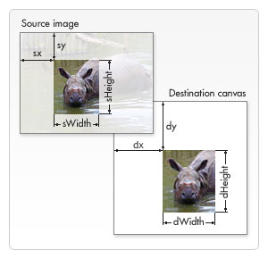

# image-process

<p align="left">
  <a href="https://npmcharts.com/compare/image-process?minimal=true"></a>
  <a href="https://www.npmjs.com/package/image-process"></a>
  <a href="https://www.npmjs.com/package/image-process"></a>
</p>

Image pre processing for upload (html5 + canvas), ie10+

解决图片上传前裁剪、等比缩放，压缩，支持本地视频、同域视频文件截图功能等。

* 裁剪图片：同时设置参数width, height

* 等比缩放：按宽度缩放，只设置width; 同理按高度缩放，只需设置height

* 不裁剪、不缩放，直接返回源文件base64数据

* 视频截图返回数据中含有字段`videoFile`, `videoWidth`, `videoHeight`, `duration`。其他参数为截图参数

https://capricorncd.github.io/image-process-tools/dist

> v4.x.x 暂时无图片裁剪控制视图

## 旧版（带图片裁剪控制视图功能）

https://github.com/capricorncd/image-process-tools/tree/v3.x.x


## 使用

#### npm

```bash
npm install image-process --save-dev
```

#### yarn

```bash
yarn add image-process 
```

#### ES6+

不实例化ZxImageProcess，直接使用期内部方法`handleMediaFile(file, options)`，返回`promise对象`

```javascript
import { handleMediaFile } from 'image-process'

const options = {
  mimeType: 'image/jpeg',
  width: 600,
  height: 400,
  quality: 0.8
}

// 处理图片或视频文件
handleMediaFile(file, options)
  .then(res => {
    console.log(res)
  })
  .catch (err => {
    console.error(err)
  })
```

browser

```html
<script src="./dist/image-process-tools.min.js"></script>
```

## Options 参数

|名称|类型|默认|说明|
|:--|:--|:--|:--|
|width|number|0|返回裁剪图片的宽度|
|height|number|0|返回裁剪图片高度|
|isForce|boolean|false|图片小于目标尺寸时，强制放大或裁剪|
|enableDevicePixelRatio|boolean|false|是否启用设备像素比，2倍时，返回的图片尺寸x2|
|mimeType|string|image/jpeg|返回截图文件类型|
|perResize|number|500|大图缩小时，为防止出现锯齿，每次缩小像素|
|quality|number|0.8|可选值范围0-1|
|cropInfo|object|undefined|图片裁剪参数|

### cropInfo

裁剪图片时，以下参数为必须项：

|名称|类型|默认|说明|
|:--|:--|:--|:--|
|sx|number|undefined|原始图片相对于左上角的x坐标|
|sy|number|undefined|原始图片相对于左上角的y坐标|
|sw|number|undefined|从sx开始需要截取的宽度|
|sh|number|undefined|从sy开始需要截取的高度|



参数说明：

https://developer.mozilla.org/en-US/docs/Web/API/CanvasRenderingContext2D/drawImage

* width: `640` 裁剪或缩放宽度为640px(可选)

  > 1.限制宽度缩放，则只需设置width值。

  > 2.限制高度缩放，则只需设置height值。

  > 3.同时设置了width、height值，则会对图片按尺寸裁剪

* height: `640` 裁剪或缩放高度为640px(可选)


## 返回数据结构

|名称|类型|说明|
|:--|:--|:--|
|base64| `base64` | 图片base64数据|
|blob| `blobData` | 处理成功的图片数据，可直接上传至服务器，或赋值给input利用form表单提交。|
|element| `canvas` | canvas节点对象|
|height| `640`  | 处理完成的图片宽度|
|width| `640` | 处理完成的图片宽度|
|url| `blob:url`| |
|raw| `Object` | 原图片相关属性(宽高/文件大小/Base64编码数据/类型/元素节点)|
|size| `21100` | 处理完成的图片文件大小|
|type| `image/jpeg` | 处理完成的图片类型

## 方法

```javascript
import { utils } from 'image-process'

utils.base64ToBlob(base4Date)
```

|名称|参数|说明|
|:--|:--|:--|
|base64ToBlob|(base64: base64)||
|convertFileSize|(size: number)||
|createCanvas|(el: Image/Canvas, params: object)||
|createElement|(tag: string, attrs: object)||
|getBase64Info|(base64: base64)|return {data, type}|
|readFile|(file: File)||
|toBlobUrl|(file: File/Blob)||

## Copyright and license

Code and documentation copyright 2018-2021. capricorncd. Code released under the MIT License.
